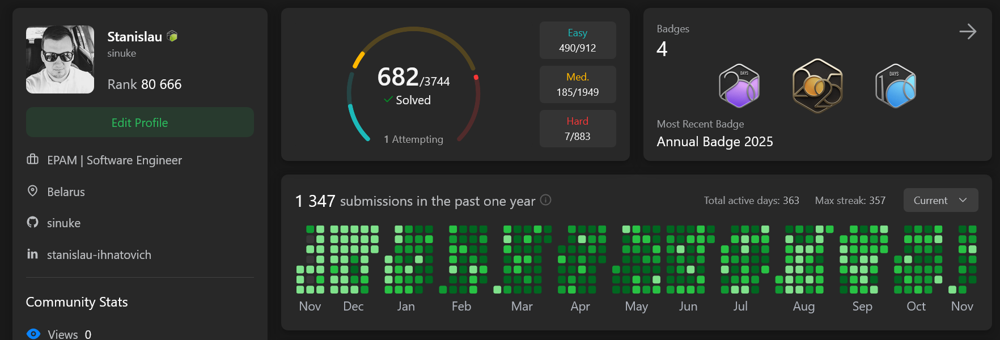

## LeetCode Solutions

LeetCode profile: https://leetcode.com/u/sinuke/

Solutions:
* [easy level](easy-level/README.md)
* [medium level](medium-level/README.md)
* [hard level](hard-level/README.md)

Used:
* Java 25
* Gradle 9.6.1
* Test Containers 2.0.3 for MySQL 9.7.0
* Claude Code skill (`/add-solution`) is used only for add solution templates to the repo. Claude Code isn't used to generate solutions
