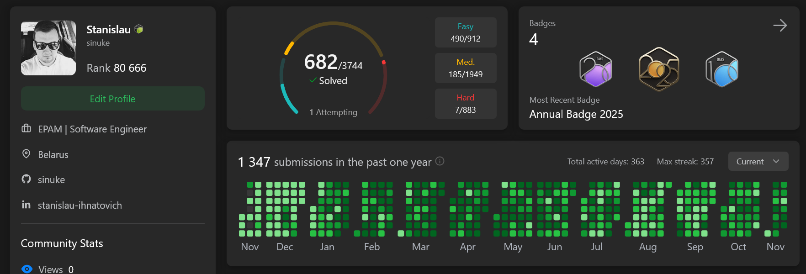

## LeetCode Solutions

LeetCode profile: https://leetcode.com/u/sinuke/

Solutions:
* [easy level](easy-level/README.md)
* [medium level](medium-level/README.md)
* [hard level](hard-level/README.md)

Used:
* Java 25
* Gradle 9.6.1
* Test Containers 2.0.3 for MySQL 9.7.0
* AI skills (`/add-solution-java`, `/add-solution-sql`, `/add-solution-js`, `/add-solution-pandas`, `/add-solution-shell`) are used only for add solution templates to the repo. They aren't used to generate solutions
