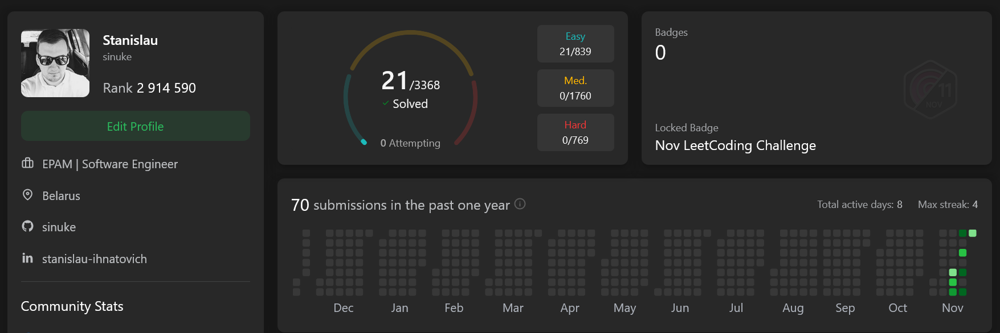

## LeetCode Solutions

LeetCode profile: https://leetcode.com/u/sinuke/

Solutions:
* [easy level](easy-level/README.md)
* [medium level](medium-level/README.md)
* [hard level](hard-level/README.md)

Used:
* Java 21
* Gradle 9.1.0
* Test Containers 1.21.3 for MySQL 9.2.0

TODOs:
* implement unit-tests for pandas solutions ([todo.txt](easy-level/pandas/todo.txt))